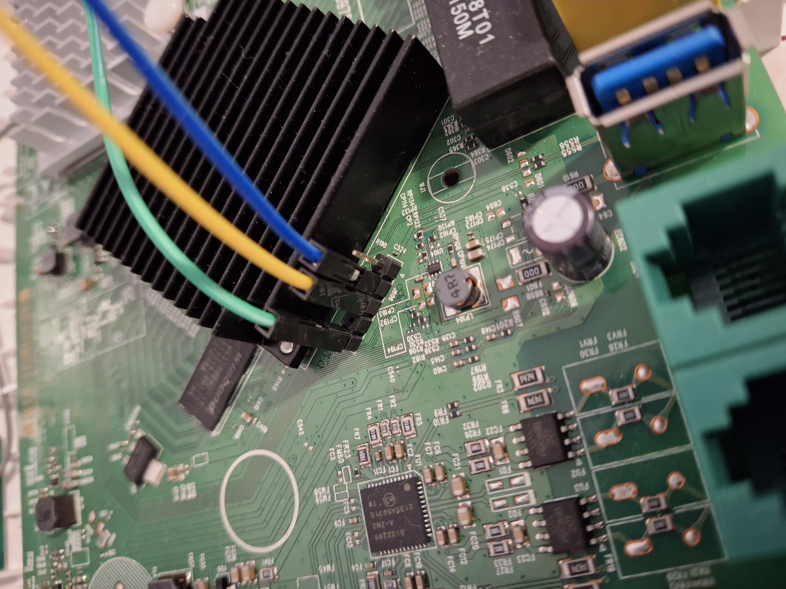

# DX3301-T0 (work in progress)
## Root and supervisor access
I have tested [`drumpinicho`](https://github.com/drumpinicho/ex3301pass) method on this versions on the DX3301-T0
| Version | Works |
| ------ | ------|
| V5.50(ACEF.0)b2_20220715 | ✅ |
| V5.50(ABVY.3.1)C0 | ✅ |
| V5.50(ABVY.3.4)C0 | ✅ |
| V5.50(ABVY.4)C0 (and later) | ❌ |
<!--| V5.50(ABVY.4.2)C0 | ❌ |
| V5.50(ABVY.5.3)C0 | ❌ |
| V5.50(ABVY.5.4)C0 | ❌ |-->

### HOW TO GET ROOT CREDENTIALS
[Here you can find the guide for getting the root and supervisor credentials (thanks drumpinicho)](https://github.com/drumpinicho/ex3301pass)

I will eventually rewrite it here

## FLASH THE FIRMWARE VIA RECOVERY MODE

from the left: GND, RX, TX, 3.3V

## Flashing the firmware
If you have a version modified by an **ISP**, you can't just flash it via GUI (you could do it if you compile your own version with the matching Model ID), I just used a USB to ttl adapter to enter the recovery mode so that i could flash the stock firmware from Zyxel

### Enter the console
Enter the console by pressing any key when you read `Hit any key to stop autoboot: `
<div style="height: 100px; overflow-y: scroll;">

    BGA IC
    Xtal:1
    DDR3 init.
    DRAMC init done. 
    Calculate size.
    DRAM size=256MB
    Set new TRFC.
    ddr-1333

    7516DRAMC V1.0 (0)
    Press 'x' or 'b' key in 1 secs to enter or skip bootloader upgrade.


    EN751627 at Tue Mar 15 16:32:58 CST 2022 version 1.1 free bootbase

    Set SPI Clock to 50 Mhz
    spi_nand_probe: mfr_id=0xef, dev_id=0xaa, dev_id2=0x21
    Using Flash ECC.
    Detected SPI NAND Flash : _SPI_NAND_DEVICE_ID_W25N01G, Flash Size=0x8000000
    bmt pool size: 81 
    BMT & BBT Init Success 


    ZyXEL zloader v1.4.5 (03/15/2022 - 16:32:56)
    Multiboot client version: 2.5
    Not found TC Phy
    Not found TC Phy
    Not found TC Phy
    Not found TC Phy
    Not found TC Phy
    GE Rext AnaCal Done! (6)(0x1a)  

    Hit any key to stop autoboot:  3
    ZHAL>
    
</div>

### Disable Model ID Check
```
ZHAL> ATDC
Model ID chcek: disabled
```

### Flash the firmware
- Connect your computer to the LAN in your router
- Set a static IP address that's in the `192.168.1.0/24` subnet (**IT CAN'T BE** `192.168.1.1`)
- Launch you **TFTP Client** and then put the `recovery.bin` file on the router (**IP: 192.168.1.1 Port: 69**)
- Wait ...
```
ZHAL> ATUR recovery.bin
Upgrade to rootfs partition 1
TFTP server is started, put your file 'recovery.bin' to server (IP is 192.168.1.1).
.....................................................................................
Total 26735063 (0x197F1D7) bytes received

File download to memory address 0x80020000, length is 26735063
Ignore checking model ID!
...
```

# CREDITS 
[credit drumpinicho](https://bandaancha.eu/foros/zyxel-ex3301-t0-obtencion-contrasena-1749511)

[github pini goat](https://github.com/drumpinicho/ex3301pass)

[official updates](https://www.zyxel.com/global/en/support/download?model=dx3301-t0)

[stock firmwares](https://www.hwupgrade.it/forum/archive/index.php//t-2975414.html)

[flash guide: pguidi](https://forum.fibra.click/d/46369-sblocco-firmware-dx3301-to)
<!--❌
b2 vs C0 G0 versions??-->